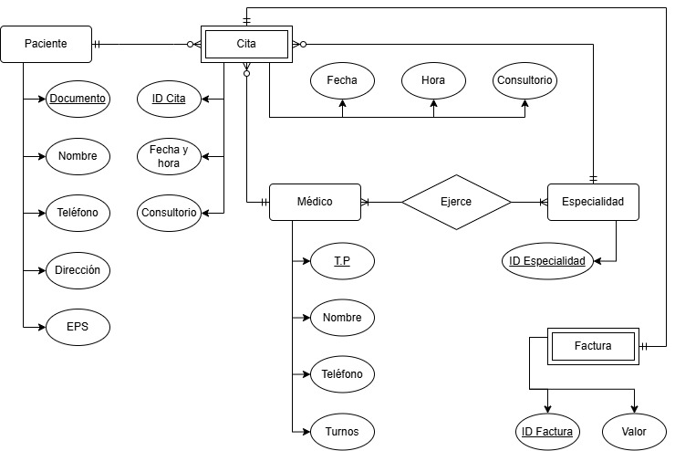

# 🗒️ Registro de Trabajo en Clase - Taller 2: Modelo de Información y Diagrama de Contexto

## 📆 Fecha de la sesión
_14 de febrero de 2026_

## 👥 Integrantes presentes
- Tomás Ariza
- Felipe Ballesteros
- Andrés Beltrán

## 🧠 Actividades realizadas en clase

Describa brevemente qué se hizo durante la sesión:

- ¿Qué se discutió con el equipo?

se discutió cómo transformar el proceso BPMN de agendamiento de citas médicas en un modelo de datos estructurado utilizando el modelo Entidad–Relación (ERD).

El equipo analizó cuáles eran los elementos del proceso que debían convertirse en entidades persistentes dentro de una base de datos. Se identificó que no todas las actividades del BPMN se traducen en entidades, sino únicamente aquellos elementos que requieren almacenamiento de información.

Se discutieron principalmente:

· Qué entidades principales intervienen en el sistema.

· Qué atributos debería tener cada entidad.

· Qué relaciones existen entre ellas.

· Las cardinalidades entre entidades.

Si era necesaria una entidad intermedia para resolver relaciones muchos a muchos.
- ¿Qué decisiones de modelado se tomaron?
  - Las entidades cita y factura se modelarían como entidades débiles
  - Todas las entidades contendrían de forma clara sus atributos
- ¿Qué herramientas se usaron (papel, pizarra, draw.io, Astah
  - draw.io
- ¿Qué parte del trabajo se alcanzó a desarrollar?
  - Modelo ER parcial de la clínica, principalmente con las relaciones entre entidades definidas, pero sin los atributos completos para cada entidad. 
## 🧩 Boceto inicial del modelo

## 🔁 Tareas definidas para complementar el taller

Anote las responsabilidades acordadas entre los miembros del equipo para completar la entrega final:

| Tarea asignada | Responsable | Fecha estimada |
|----------------|-------------|----------------|
| Modelado e informe final clínica | Felipe Ballesteros | 20/02 |
| Redacción del informe cliente     | Tomás Ariza | 20/02 |
| Modelado final caso cliente | Andrés Beltrán | 20/02 |

---

_Este documento resume el trabajo colaborativo realizado durante la sesión del taller 2 en el curso AREM - Universidad de La Sabana._
